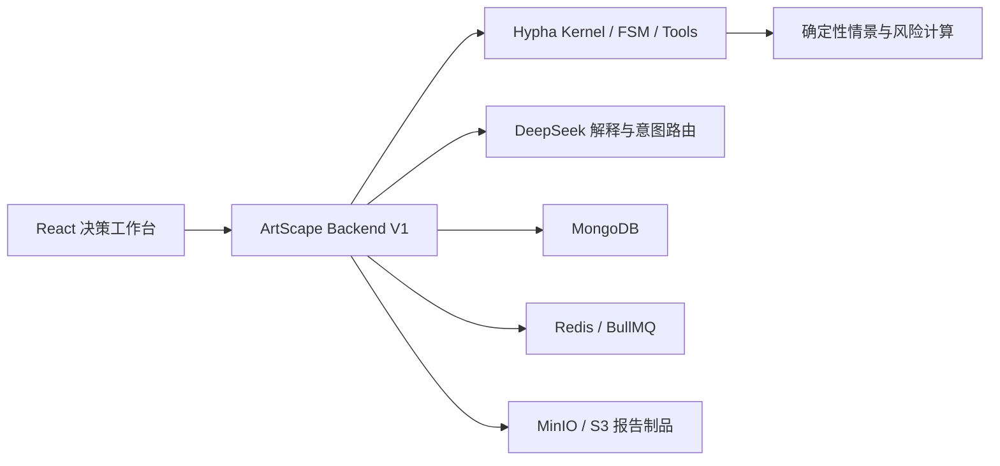

# ArtScape

ArtScape 是一个基于 [Hypha](https://github.com/CodeSoul-co/Hypha) 开发的艺术品组合配置沙盘 Agent。它把艺术品持仓导入、版本确认、三情景估值、风险识别、AI 解释、候选配置、版本对比、报告导出和审计回放连接成一条可治理的决策链路。

项目包含可运行的 Backend V1 和桌面端演示前端，适合艺术品组合研究、内部方案评审和产品演示。当前版本不接入实时市场数据，不执行交易，AI 也无权生成或修改计算值。

> [!IMPORTANT]
> **ArtScape 不能脱离 Hypha 单独安装或运行。** 本仓库不会包含、复制或提交任何 Hypha 源文件。克隆 ArtScape 后，必须再将 Hypha 的 `dev-domain-merge` 分支克隆到项目根目录的 `Hypha/`，并切换到 `hypha.lock.json` 指定的 Commit。

## 核心能力

- 导入中文表头的 XLSX 艺术品持仓，并进行格式、字段和数值校验。
- 人工确认后生成不可变组合版本 V1。
- 使用确定性计算工具运行繁荣、基准、承压三种三年情景。
- 识别艺术家集中度、低流动性敞口、数据完整度和熊市损失风险。
- 使用 DeepSeek 解释已经计算完成的指标，不允许模型改写数值。
- 在总额守恒和非负约束下生成候选配置，经人工确认后固化 V2。
- 对比 V1/V2 的情景价值和风险指标变化。
- 将同一冻结快照导出为 JSON 与嵌入中文字体的 PDF。
- 保存 Job、Run、事件、审批、快照哈希、回放和回归证据。
- 提供 JWT/RBAC、MongoDB、Redis/BullMQ、MinIO/S3 和 Prometheus 指标支持。

## 系统结构



核心边界：

- Hypha 提供 Kernel、FSM、Tool Runtime、治理事件和基础设施抽象。
- ArtScape 只在 `backend/`、`frontend/`、`domain-pack/` 和 `skills/` 中实现艺术品业务能力。
- `Hypha/` 始终是独立 Git 仓库，不属于 ArtScape 的提交历史。
- `hypha.lock.json` 只记录依赖仓库、分支和固定 Commit，不包含 Hypha 源代码。

## 环境要求

- Git
- Conda
- Node.js 20 或更高版本
- Docker Desktop（运行完整生产依赖时需要）
- DeepSeek API Key（使用真实 AI 解释时需要）

本项目约定使用名为 `Hypha` 的 Conda 环境：

```powershell
conda create -n Hypha nodejs=20 -y
```

如果该环境已经存在，可直接复用。

## 克隆项目和 Hypha

### 1. 克隆 ArtScape

```powershell
git clone https://github.com/Julian-ZYF/ArtScape.git
cd ArtScape
```

### 2. 必须单独克隆 Hypha

```powershell
git clone --branch dev-domain-merge https://github.com/CodeSoul-co/Hypha.git Hypha
```

校验 Hypha 分支、Commit 和工作区状态：

```powershell
conda run -n Hypha npm run check:hypha
```

校验失败时不要继续构建。请确认 `Hypha/` 位于 ArtScape 根目录、当前分支为 `dev-domain-merge`、Commit 与 `hypha.lock.json` 一致，且 Hypha 工作区没有本地修改。

## 安装依赖

先安装并构建 Hypha，再安装 ArtScape：

```powershell
conda run -n Hypha npm --prefix Hypha install
conda run -n Hypha npm --prefix Hypha run build:packages -- --force
conda run -n Hypha npm install
conda run -n Hypha npm run check:hypha
```

ArtScape 的 `@hypha/*` 依赖通过本地 `Hypha/packages/*` 解析，因此在缺少 `Hypha/` 时，`npm install`、TypeScript 构建和 Docker 镜像构建都会失败。这是预期的依赖边界。

## 配置

复制环境变量模板：

```powershell
Copy-Item .env.example .env
```

至少配置：

```dotenv
OPENAI_API_KEY=your-deepseek-api-key
OPENAI_MODEL=deepseek-chat
OPENAI_BASE_URL=https://api.deepseek.com
AI_PROVIDER_NAME=deepseek
JWT_SECRET=replace-with-at-least-32-random-characters
```

不要提交 `.env`、API Key、JWT Secret、对象存储密码或生产连接串。

## 本地开发

启动后端：

```powershell
conda run -n Hypha npm run dev
```

后端默认地址为 `http://localhost:3100`：

```text
GET /health/live
GET /health/ready
GET /api/v1/artscape/status
GET /api/v1/artscape/openapi.json
```

在另一个终端启动前端：

```powershell
conda run -n Hypha npm run dev:web
```

访问 `http://localhost:5173`。本地非生产后端允许 Vite 代理使用受信任的开发身份头；生产环境必须使用 JWT。

## Docker Compose

完整栈包含 MongoDB、Redis、MinIO 和 ArtScape Backend：

```powershell
docker compose -f infra/docker/docker-compose.yml up -d --build
```

> [!NOTE]
> Dockerfile 会从构建上下文复制并构建根目录下的 `Hypha/`。因此即使使用 Docker，也必须先按照前面的步骤克隆 Hypha。

查看服务状态：

```powershell
docker compose -f infra/docker/docker-compose.yml ps
curl.exe http://localhost:3100/health/ready
```

连接正在运行的 Docker 后端启动前端：

```powershell
conda run -n Hypha npm run dev:web:docker
```

该开发命令只会把本地容器的 JWT 配置传给 Vite 的 Node 代理，密钥不会进入浏览器构建。

## 演示流程

1. 打开决策工作台并运行内置的 10 件艺术品样例，或上传自己的 XLSX。
2. 检查持仓、数据质量和流动性敞口，人工确认 V1。
3. 运行三情景估值和风险分析。
4. 查看 DeepSeek 的结构化解释。
5. 生成并审核候选配置，确认后固化 V2。
6. 对比 V1/V2 的风险与可实现价值。
7. 导出 PDF/JSON 报告并查看审计事件。

## 测试和验证

```powershell
conda run -n Hypha npm run typecheck
conda run -n Hypha npm run build
conda run -n Hypha npm run test
conda run -n Hypha npm run verify
```

在 Docker 后端和前端代理运行时，可以执行完整链路测试：

```powershell
conda run -n Hypha npm run smoke:live --workspace @artscape/web
```

测试链路覆盖 XLSX 导入、异步 Job、V1、三情景、DeepSeek、候选方案、V2、版本对比、MinIO PDF/JSON 和审计事件。

## 项目目录

```text
ArtScape/
├─ backend/artscape-node/       Backend V1、测试和报告渲染
├─ frontend/artscape-web/       React/Vite 桌面端
├─ domain-pack/                 ArtScape Domain Pack
├─ skills/                      Agent 业务规则
├─ fixtures/                    可提交的固定测试样例
├─ infra/docker/                完整基础设施 Compose
├─ scripts/                     Hypha 依赖校验
├─ hypha.lock.json              Hypha 分支与 Commit 锁
└─ Hypha/                       必须另行克隆，永不提交
```

## 安全与产品边界

- 不使用实时市场数据进行估值。
- AI 不生成价格，不修改确定性计算结果。
- 系统不执行自动调仓或交易。
- V1/V2 是不可变快照，版本写入必须由用户确认。
- 报告 JSON 与 PDF 来自同一个冻结快照并记录 SHA-256。
- 所有用户身份来自受验证的 JWT，生产环境禁用开发身份头。
- 上传仅接受带有效容器签名的 `.xlsx`，并限制文件大小和行数。

## Hypha 依赖声明

ArtScape 是 Hypha 之上的独立业务项目。ArtScape 仓库不分发 Hypha、不修改 Hypha 的 Git 历史，也不会将 Hypha 作为嵌套仓库、子模块或复制目录提交。Hypha 的使用和许可遵循其上游仓库约定。
